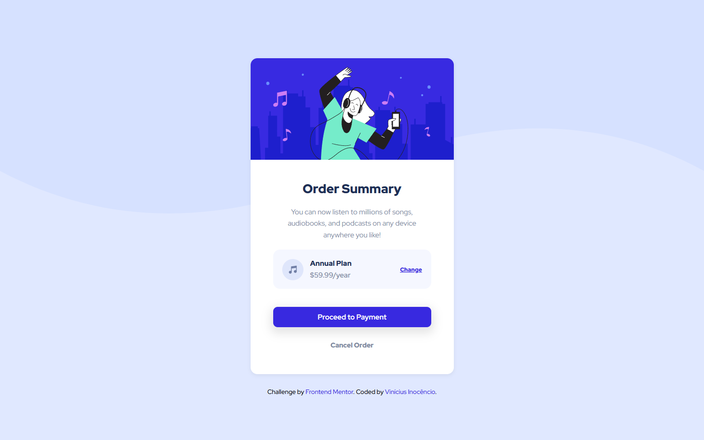
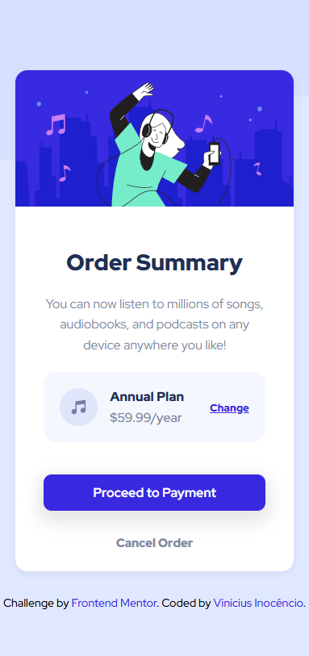

# 💳 Order Summary Card

Uma interface simples e intuitiva para exibir o resumo de uma assinatura digital. O componente mostra o plano escolhido, o valor anual e oferece opções para alterar ou cancelar a compra.

---

## 📌 Descrição

Este projeto foi desenvolvido como parte de um desafio da **Frontend Mentor** com foco em construir um componente limpo, responsivo e com boa hierarquia visual. Foi utilizado **HTML semântico** e **CSS** com técnicas modernas de layout e organização de conteúdo.

---

## ⚙️ Funcionalidades

- Estrutura semântica com `HTML5`
- Estilização com `CSS3` (tipografia, espaçamento e cores)
- Layout adaptável a diferentes tamanhos de tela
- Botões de ação com estilo e posicionamento consistentes

---

## 🛠️ Tecnologias

- HTML5  
- CSS3  

---

## 🖥️ Resultado

### 💻 Versão Desktop  

### 📱 Versão Mobile  

---

🔗 [**Clique aqui para visualizar o projeto no GitHub Pages**](https://inocenciooo.github.io/order-summary-component-main)

---

## 💬 Contribuições

Este projeto é parte do meu aprendizado contínuo em **desenvolvimento front-end**. Sinta-se à vontade para sugerir melhorias, abrir issues ou contribuir!
